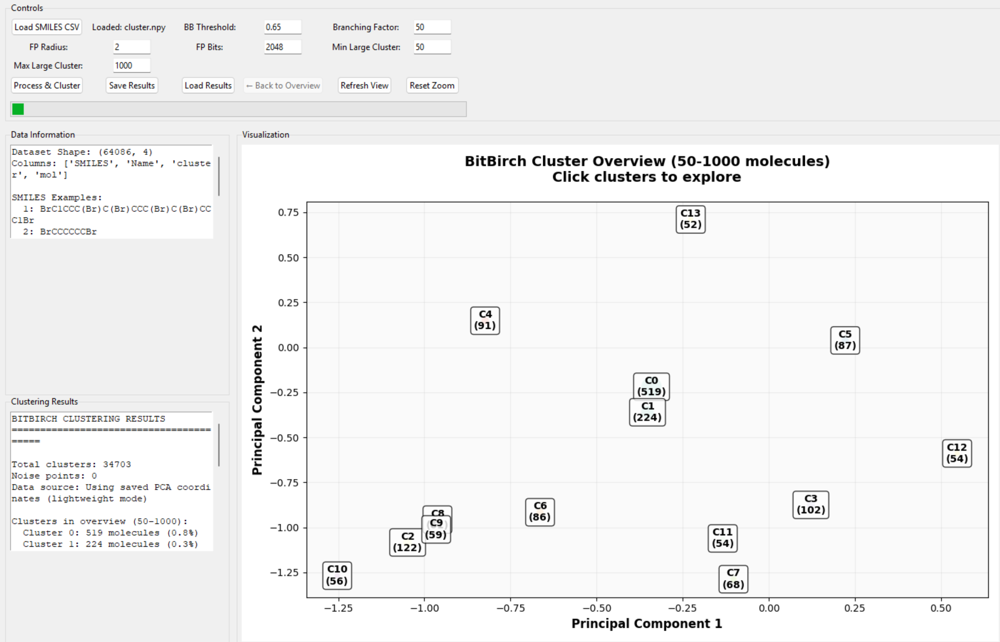
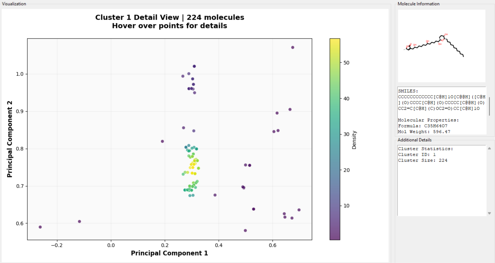

# NAMI

A powerful GUI application for molecular clustering and visualization using BitBirch clustering algorithm with PCA dimensionality reduction. Provides a tool for chemists to visualize and analyze large chemical libraries.

## Features

- **Interactive Visualization**: 
  - Overview of all clusters with size-based filtering
  - Detailed cluster exploration with molecular structure display
  - Interactive zoom, pan, and hover functionality
- **Data Persistence**: Save and load clustering results for later analysis
- **Options**: 
   - User can specify Similarity Threshold, Branching Factor, FP Radius and Bits for Morgan Fingerprints
   - Range of cluster sizes to view by the number of molecules

## Visuals
<p align="center">

| Overview Mode | Detail Mode |
|:-------------:|:-----------:|
|  |  |
| Shows cluster centroids containing molecules in the specified range. | Shows molecules within a cluster, allows for detailed exploration. |

</p>

## Installation

```bash
gitclone repo link
cd 
```


### Prerequisites

- Python 3.7 or higher
- pip package manager

### Method 1: Using pip (Recommended)

```bash
# Create a virtual environment (recommended)
python -m venv bitbirch_env
source bitbirch_env/bin/activate  # On Windows: bitbirch_env\Scripts\activate

# Install dependencies
pip install -r requirements.txt
```

### Method 2: Using conda

```bash
# Create conda environment
conda create -n bitbirch_env python=3.8
conda activate bitbirch_env

# Install dependencies
conda install pandas numpy scikit-learn matplotlib tkinter
pip install rdkit bitbirch tqdm mplcursors pillow
```

### Dependencies

The application requires the following Python packages:

```
pandas>=1.3.0
numpy>=1.21.0
scikit-learn>=1.0.0
matplotlib>=3.4.0
rdkit>=2022.03.1
bitbirch>=1.0.0
tqdm>=4.62.0
mplcursors>=0.4.0
pillow>=8.3.0
```

## Usage

### Starting the Application

```bash
python main.py
```

### Basic Workflow

1. **Load Data**: Click "Load SMILES CSV" to load your molecular dataset
   - Supported formats: CSV files with SMILES column
   - Optional: Include a "Name" column for molecule identifiers

2. **Configure Parameters**:
   - **BB Threshold**: BitBirch clustering threshold (0.0-1.0)
   - **Branching Factor**: Maximum number of subclusters per node
   - **FP Radius**: Morgan fingerprint radius
   - **FP Bits**: Number of bits in fingerprint
   - **Min/Max Large Cluster**: Size range for clusters shown in overview

3. **Process & Cluster**: Click to generate fingerprints and perform clustering

4. **Explore Results**:
   - **Overview**: See all clusters, click to explore details
   - **Detail View**: Hover over molecules to see structures and properties
   - Use mouse wheel to zoom, drag to pan

5. **Save/Load**: Save clustering results for later analysis

### Data Format

Your CSV file should contain:
- **Required**: `SMILES` column with valid SMILES strings
- **Optional**: `Name` column with molecule identifiers

Example CSV format:
```csv
SMILES,Name
CCO,Ethanol
c1ccccc1,Benzene
CC(C)O,Isopropanol
```

## File Structure

```
bitbirch-visualizer/
├── main.py                 # Main application entry point
├── gui_utils.py            # GUI components and utilities
├── data_processing.py      # Data loading, processing, and clustering
├── data_visualization.py   # Visualization and plotting functions
├── requirements.txt        # Python dependencies
├── setup.py               # Automated installation script
├── README.md              # This file
├── INSTALL.md             # Detailed installation guide
├── images/                # Screenshots
│   ├── overview_mode.png
│   └── detail_mode.png
└── examples/              # Example datasets
    └── sample_molecules.csv
```

## Algorithm Details

### BitBirch Clustering
- Efficient clustering algorithm for binary data (molecular fingerprints)
- Builds a tree structure for fast similarity searches
- Parameters:
  - **Threshold**: Maximum diameter for clusters
  - **Branching Factor**: Tree structure parameter

### Morgan Fingerprints
- Circular fingerprints based on molecular connectivity
- Parameters:
  - **Radius**: Number of bonds to consider around each atom
  - **NBits**: Fingerprint length (higher = more detailed)

### PCA Visualization
- Reduces high-dimensional fingerprint data to 2D for visualization
- Preserves major variance patterns in the data
- Applied to both cluster centroids and individual molecules

## Parameters Guide

| Parameter | Recommended Range | Description |
|-----------|------------------|-------------|
| BB Threshold | 0.3 - 0.8 | Lower = more clusters, Higher = fewer clusters |
| Branching Factor | 20 - 100 | Tree structure parameter, affects performance |
| FP Radius | 2 - 4 | Larger captures more structural context |
| FP Bits | 1024 - 4096 | More bits = higher resolution fingerprints |
| Min Cluster Size | 5 - 50 | Minimum size for clusters shown in overview |
| Max Cluster Size | 100 - 10000 | Maximum size for clusters shown in overview |

### Lightweight Save Mode
The application saves essential data only:
- SMILES strings and cluster assignments
- PCA coordinates for visualization
- Clustering parameters
- Molecular names (if available)

This approach ensures fast save/load times while preserving visualization capabilities.

### Interactive Features
- **Zoom/Pan**: Mouse wheel and drag for navigation
- **Hover Information**: See molecular structures and properties
- **Click Navigation**: Click clusters to explore details
- **Back Navigation**: Return to overview from detail views

## Citation

Paper: 