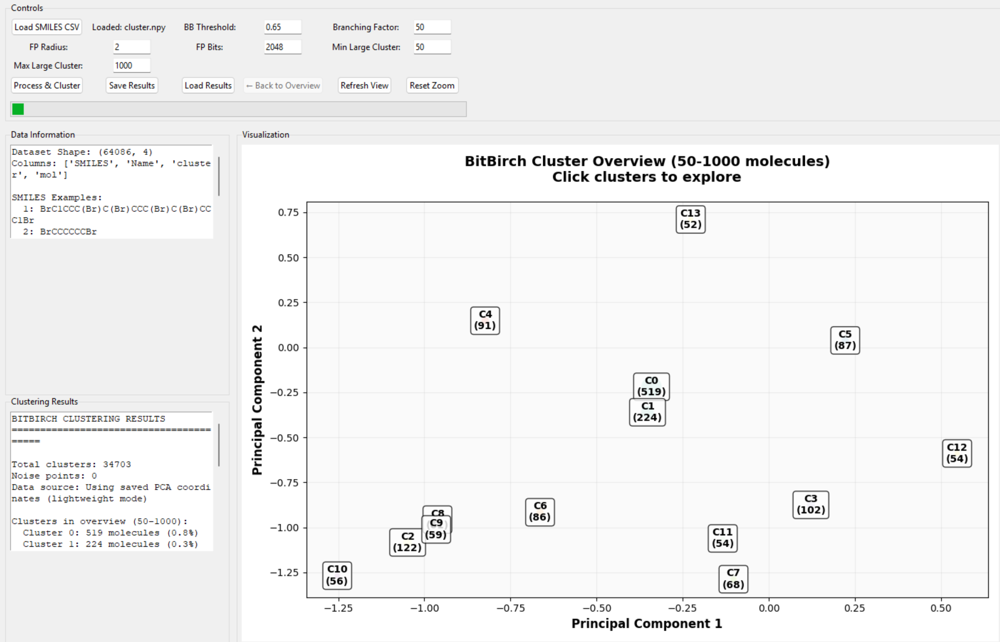
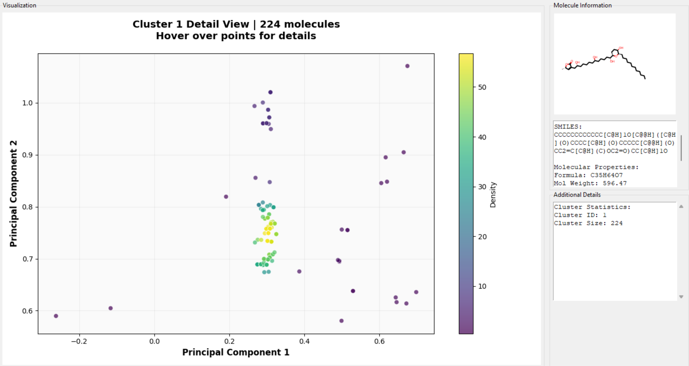

# N-Ary Mapping Interface (NAMI)

A powerful GUI application for molecular clustering and visualization using BitBirch clustering algorithm with PCA dimensionality reduction. Provides a tool for chemists to visualize and analyze large chemical libraries.

## Features

- **Interactive Visualization**: 
  - Overview of all clusters with size-based filtering
  - Detailed cluster exploration with molecular structure display
  - Interactive zoom, pan, and hover functionality
- **Data Persistence**: Save and load clustering results for later analysis
- **Options**: 
   - User can specify Similarity Threshold, Branching Factor, FP Radius and Bits for Morgan Fingerprints
   - Range of cluster sizes to view by the number of molecules

## Visuals
<p align="center">

| Overview Mode | Detail Mode |
|:-------------:|:-----------:|
|  |  |
| Shows cluster centroids containing molecules in the specified range. | Shows molecules within a cluster, allows for detailed exploration. |

</p>

## Installation

```bash
git clone https://github.com/mqcomplab/NAMI.git
cd NAMI
```

```bash
conda create -n nami-env python=3.11
conda activate nami-env
BITBIRCH_BUILD_CPP=1 pip install -e .
```

This installs the project in editable mode and pulls in the required bblean dependency from the GitHub repository.


## Usage

### Starting the Application

```bash
python NAMI/main.py
```
### Basic Workflow

1. **Load Data**: Click "Load SMILES CSV" to load your molecular dataset
   - Supported formats: CSV files with SMILES column

2. **Configure Parameters**:
   - **BB Threshold**: BitBirch clustering threshold (0.0-1.0)
   - **Branching Factor**: Maximum number of subclusters per node
   - **FP Radius**: Morgan fingerprint radius
   - **FP Bits**: Number of bits in fingerprint
   - **Min/Max Large Cluster**: Size range for clusters shown in overview

3. **Process & Cluster**: Click to generate fingerprints and perform clustering

4. **Explore Results**:
   - **Overview**: See all clusters, click to explore details
   - **Detail View**: Hover over molecules to see structures and properties
   - Use mouse wheel to zoom, drag to pan

5. **Save/Load**: Save clustering results for later analysis

## Citation

Paper: 


