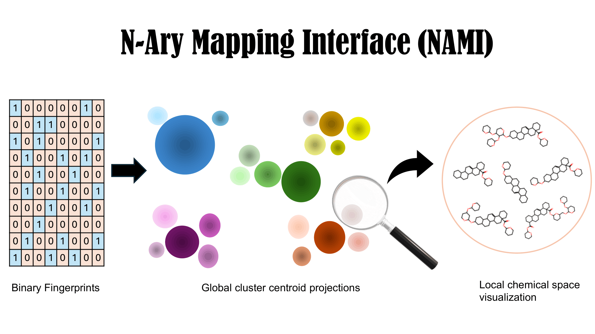

# N-Ary Mapping Interface (NAMI)


A powerful GUI application for molecular clustering and visualization using BitBirch clustering algorithm with PCA dimensionality reduction. Provides a tool for chemists to visualize and analyze large chemical libraries.

## Features

- **Interactive Visualization**: 
  - Overview of all clusters with size-based filtering
  - Detailed cluster exploration with molecular structure display
  - Interactive zoom, pan, and hover functionality
- **Data Persistence**: Save and load clustering results for later analysis
- **Options**: 
   - User can specify Similarity Threshold, Branching Factor, FP Radius and Bits for Morgan Fingerprints
   - Range of cluster sizes to view by the number of molecules

## Visuals
<p align="center">

| Overview Mode | Detail Mode |
|:-------------:|:-----------:|
|  |  |
| Shows cluster centroids containing molecules in the specified range. | Shows molecules within a cluster, allows for detailed exploration. |

</p>

## Installation

```bash
git clone https://github.com/mqcomplab/NAMI.git
cd NAMI
```

```bash
conda create -n nami-env python=3.11
conda activate nami-env
BITBIRCH_BUILD_CPP=1 pip install -e .
```

This installs the project in editable mode and pulls in the required bblean dependency from the GitHub repository.


## Usage

### Starting the Application

From the repository root, start the GUI with:

```bash
python NAMI/main.py
```

### Basic Workflow

1. **Load a SMILES dataset**
   - Click "Load SMILES CSV" and select your input file.
   - The loader accepts CSV files with a SMILES column, single-column SMILES lists, or two-column SMILES/Name files.

2. **Configure clustering parameters**
   - **BB Threshold**: BitBirch similarity cutoff.
   - **Branching Factor**: Maximum number of subclusters per node.
   - **FP Radius** and **FP Bits**: Morgan fingerprint settings.
   - **Min Large Cluster** and **Max Large Cluster**: Filter which cluster sizes appear in the overview.
   - Optional toggles include:
     - **Hide singletons** to reduce memory usage and clutter.
     - **Parallel clustering** for very large datasets.

3. **Process and cluster**
   - Click "Process & Cluster" to generate fingerprints, run BitBirch clustering, and compute the PCA-based layout.
   - For very large libraries, enable parallel clustering and set the number of worker processes.

4. **Explore the results**
   - **Overview mode** shows the cluster centroids; click a point to jump to the matching cluster.
   - **Detail view** shows the molecules belonging to the selected cluster, along with structure and property information.
   - Use the mouse wheel to zoom, drag to pan, and use the navigation buttons to return to the overview or reset the view.
   - Review the generated analysis summaries for the **top 20 clusters** and the **top 5 scaffolds** to quickly identify the most prominent groups in the dataset.

5. **Save or reload analyses**
   - Use "Save Results" to export the current clustering layout and metadata.
   - Use "Load Results" to reopen a previous analysis without recomputing the clustering.

## Citation

Paper: 


